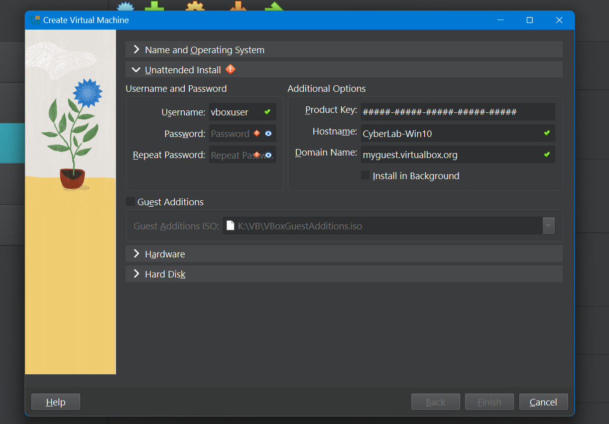
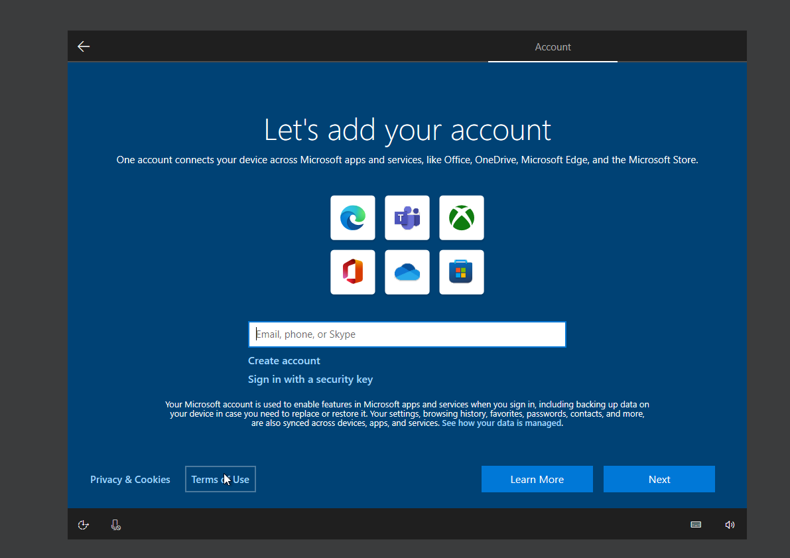
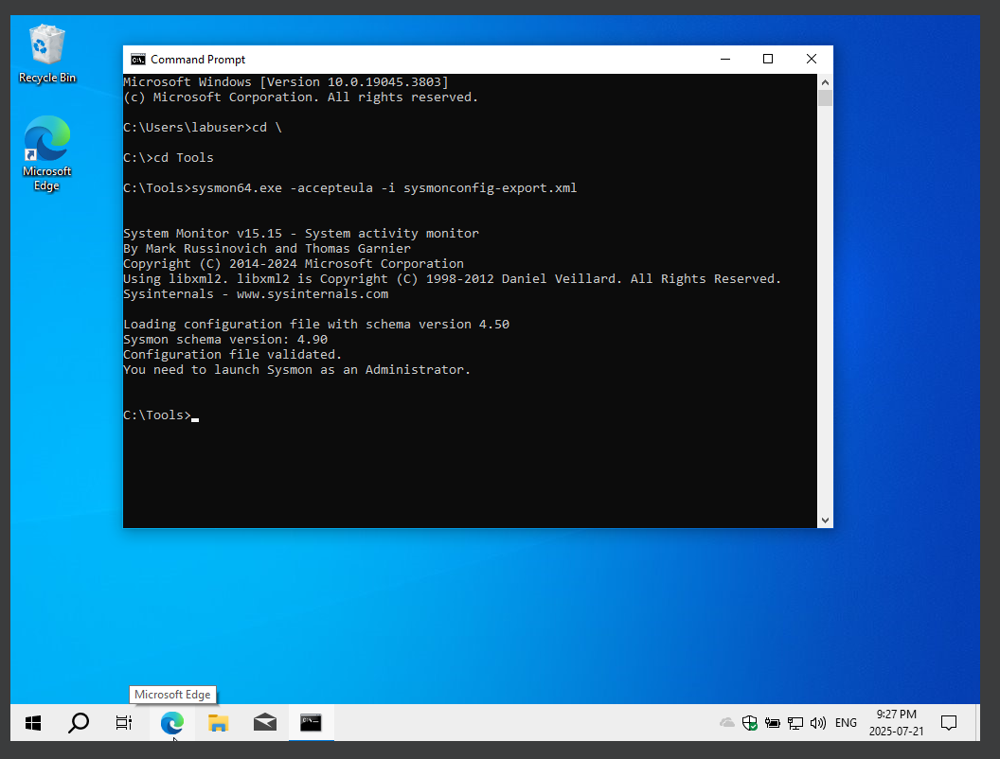
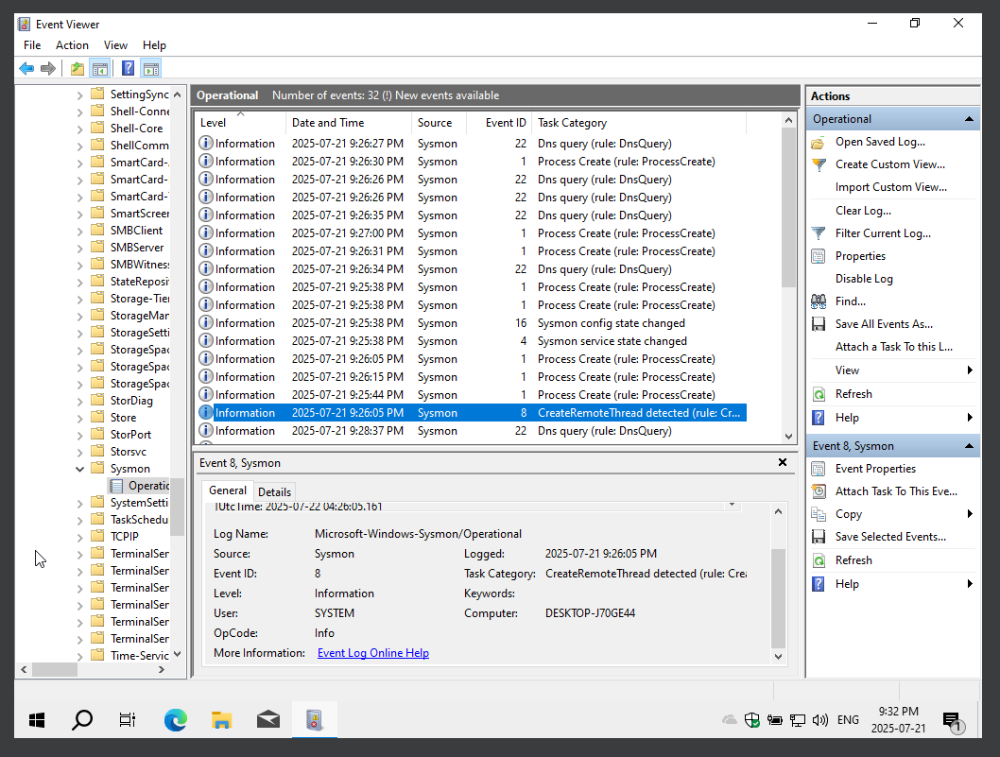
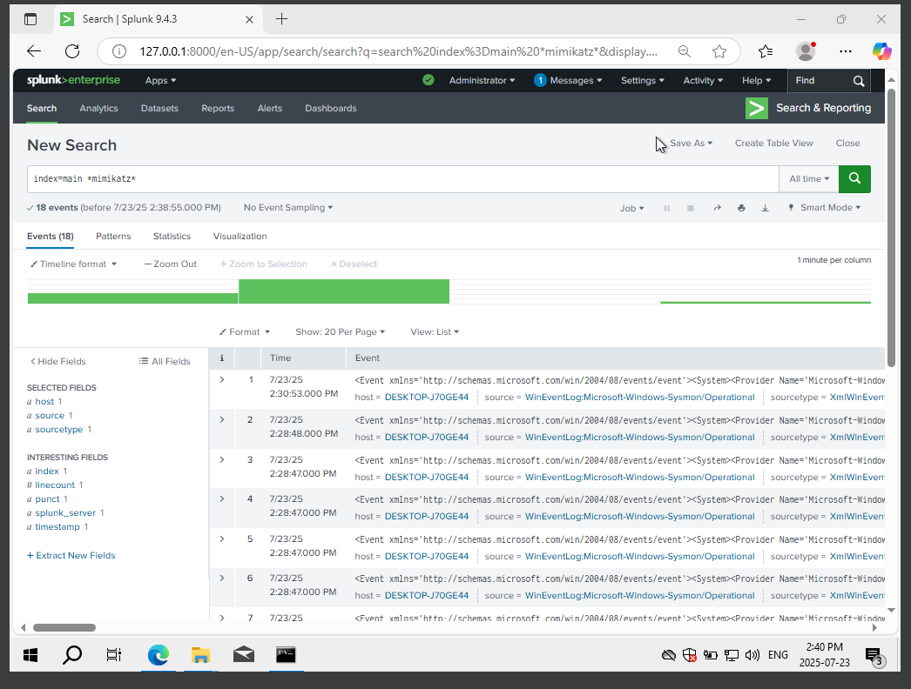
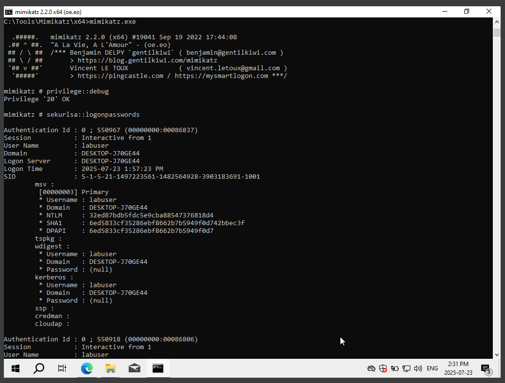
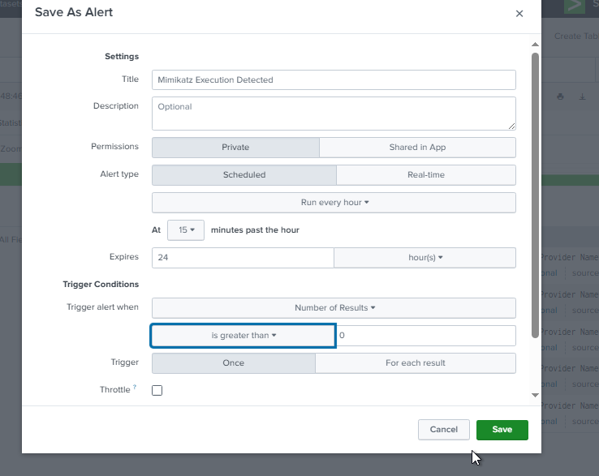
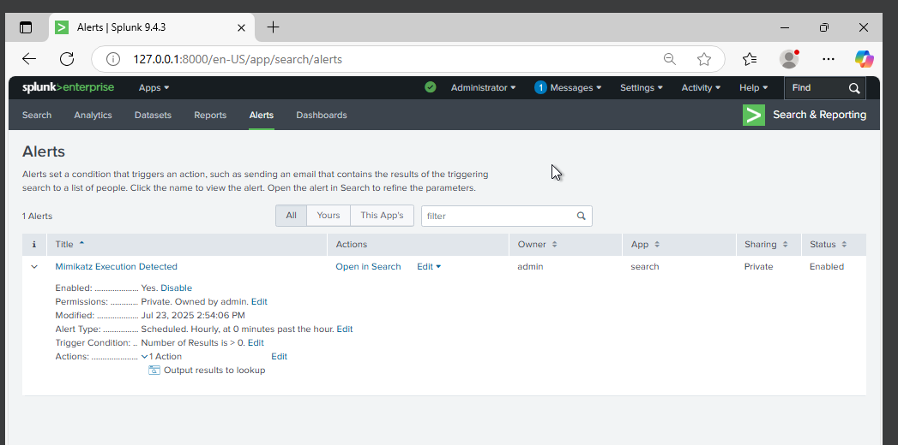

# 🔐 Blue Team Project: Detecting Mimikatz with Splunk + Sysmon

## 🎯 What This Project Is About
I built this lab to simulate how a **Blue Team can detect a credential dumping attack** using **Sysmon** and **Splunk**.  
I ran a real **Mimikatz attack** inside a Windows 10 VM and created a Splunk alert to catch it.

---

## 🛠 Tools & Setup
- **Windows 10 VM (VirtualBox)**
- **Sysmon** (with SwiftOnSecurity’s config)
- **Splunk Free**
- **Mimikatz (for simulation)**

---

## ✅ What I Did

### 1. Set up Windows 10 VM
I created a clean Windows 10 VM on VirtualBox.  
  
(Optional initial setup screenshot)  

---

### 2. Installed Sysmon and Verified Logs
- I installed Sysmon with a community config to log process creation and command-line activity.  
- I verified the logs in **Event Viewer → Sysmon → Operational**.  
  

---

### 3. Installed Splunk and Ingested Sysmon Logs
- I installed Splunk and added the Sysmon Operational logs.  
- I confirmed the logs were streaming into Splunk successfully.  

---

### 4. Simulated the Attack with Mimikatz
- I disabled Windows Defender (lab only).  
- I ran the following commands in Mimikatz:<code>privilege::debug
sekurlsa::logonpasswords</code>
- This simulated a credential dumping attack.  

---

### 5. Detected & Alerted in Splunk
- I used this query to detect the execution: index=main "mimikatz"
- I created a Splunk alert called **“Mimikatz Execution Detected”** to automatically trigger whenever such activity is logged.
### 🔹 Detection Rule Export
I also saved the Splunk detection rule as a file so it can be reused:  
[**detection-rule.spl**](detection-rule.spl)

**Alert Configuration**  
  

**Alert Triggered in Splunk**  

---

## 🔍 What I Learned
- **Sysmon is powerful** for capturing process and command-line activity.  
- **Even basic attacks like Mimikatz can be detected easily** with proper logging and monitoring.  
- **Splunk alerts make detection quick and actionable**, even in a small lab setup.

---

## 🚀 Next
- Add detection rules for **LSASS memory dumps** and **suspicious network beacons**.  
- Build a simple SOC-style dashboard in Splunk.
