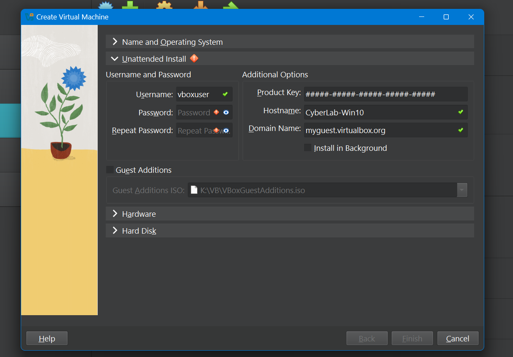
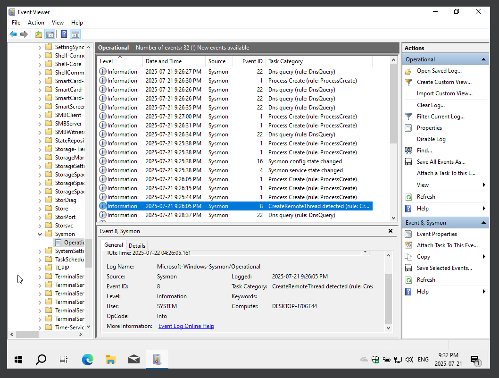
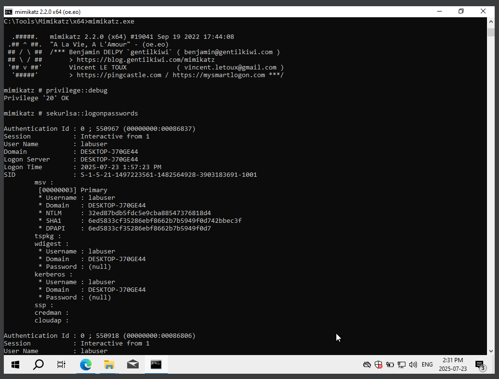
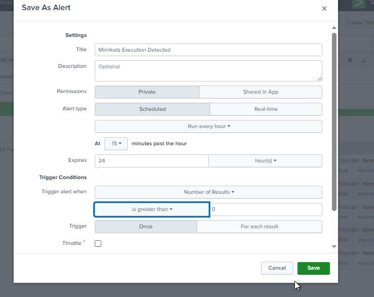
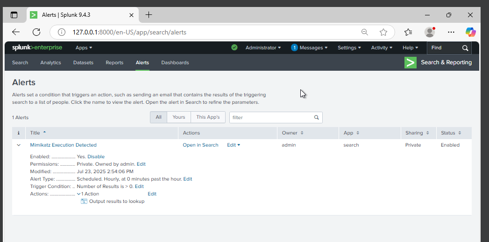

# 🛠 Lab Setup: Blue Team Mimikatz Detection

This is exactly how I built and tested this lab so anyone can replicate it.

---

## 1. Windows 10 Virtual Machine
- I installed Windows 10 on VirtualBox.  
- After installation, I took a snapshot to roll back if something broke.  

---

## 2. Install Sysmon
1. I downloaded **Sysmon** from Microsoft Sysinternals.  
2. I downloaded the **SwiftOnSecurity Sysmon config** from GitHub.  
3. I installed Sysmon using CMD (Run as Administrator): `sysmon64.exe -accepteula -i sysmonconfig-export.xml`
4. I confirmed it was working by checking logs in Event Viewer:  `Applications and Services Logs → Microsoft → Windows → Sysmon → Operational`

  

---

## 3. Install and Configure Splunk
1. I installed **Splunk Free** and logged in at `http://127.0.0.1:8000`.  
2. I added the **Sysmon Operational logs** (via `inputs.conf` or UI).  
3. I confirmed that Sysmon logs were streaming into Splunk using a basic search:`index=main`

---

## 4. Simulate the Attack (Mimikatz)
1. I disabled Windows Defender (only for this lab).  
2. I ran the following Mimikatz commands to simulate a credential dumping attack:`privilege::debug sekurlsa::logonpasswords`

---

## 5. Detect the Attack in Splunk
1. I searched for any signs of Mimikatz in Sysmon logs: `index=main "mimikatz"`
2. I created a Splunk alert to trigger whenever Mimikatz execution is detected automatically:
- **Name:** Mimikatz Execution Detected  
- **Condition:** Trigger when results > 0  
- **Schedule:** Every 5 minutes  

**Alert Configuration**  
  

**Alert View in Splunk**  

---

✅ **Done!**  
I now have a working Blue Team lab that can detect basic credential dumping attacks.

